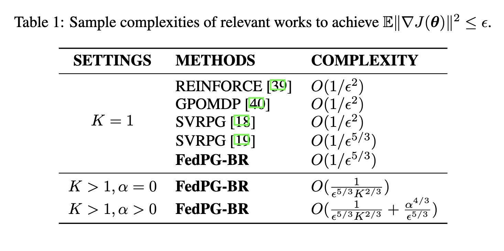
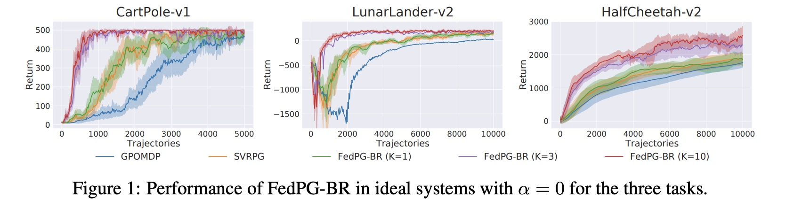
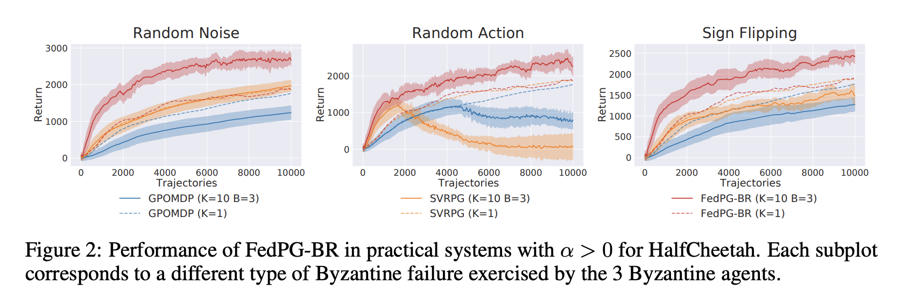
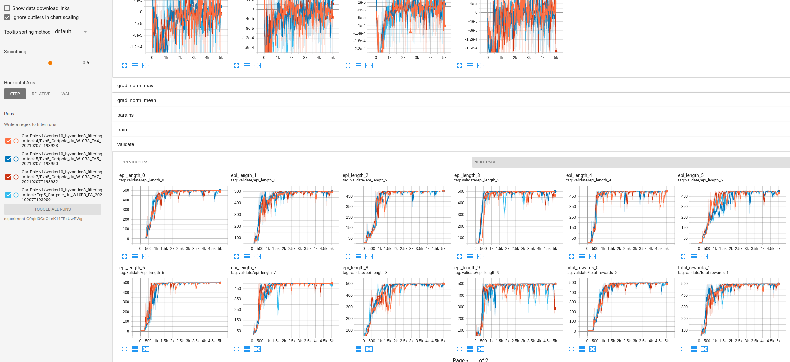

# Federated Policy Gradient with Byzantine Resilience (FedPG-BR)
This is the code for the FedPG-BR framework  presented in the paper: 

Flint Xiaofeng Fan, Yining Ma, Zhongxiang Dai, Wei Jing, Cheston Tan and Kian Hsiang Low. "[Fault-Tolerant Federated Reinforcement Learning with Theoretical Guarantee](https://arxiv.org/pdf/2110.14074.pdf)." *In 35th Conference on Neural Information Processing Systems (NeurIPS-21)*, Dec 6-14, 2021.


The experimental results in in the published paper were obtained using a computing server with the following configurations: Ubuntu 18.04 with a 14 cores (28 threads) Intel(R) Core(TM) i9-10940X CPU @ 3.30GHz and 64G memory. Our experiments can be easily reproduced on a moderate machine <ins>with no GPUs</ins>. The only tricky thing in setting up the experiment might be the versions of `mujoco` and `mujoco-py`. If you have difficulties in the setup, feel free to open an issue by specifying the dependencies of your environment and the command you run.

Table of Contents
=================

   * [TLDR](#TLDR)
   * [Technical aspects](#Technical-aspects-in-summary)
   * [Theorems](#theorems)
   * [Results](#results)
   * [Dependencies](#dependencies)
   * [Installation](#Installation)
   * [Visualization](#Visualization)
      * [Training stats](#training-stats)
      * [Rendering](#rendering)
      * [Demo](#demo)
   * [Acknowledgements](#acknowledgements)
   * [Cite](#cite)

---

# TLDR
This paper provides the theoretical ground to study the **sample efficiency** of Federated Reinforcement Learning with respect to **the number of participating agents**, accounting for **Byzantine agents**. Specifically, we aim to answer the following questions:
- how to learn a better policy when sampling capability is restricted (e.g., limited samples)
- does the setup of **federated learning** guarantee the sample efficiency improvement of reinforcement learning agents?
- how does this improvement correlates with the number of participating agents?
- what happens if some agents turn into faulty agents (ie., Byzantine agents)?

# Technical aspects in summary
## Federated Policy Gradient with SCSG optimization
- Federated version of policy gradient running SCSG (Stochastically Controlled Stochastic Gradient, see the [scsg paper](https://proceedings.neurips.cc/paper/2017/file/81ca0262c82e712e50c580c032d99b60-Paper.pdf)) optimization
- SCSG enables a refined control over the PG estimation variance
## Simulations of Byzantine baviours in distributed/federated RL systems
- to capture the fault-tolerance aspects in Federated RL systems, we consider the most strigent fault formalism -- **Byzantine faults** which considers a small fraction of agents may behave arbitrarily and possibly adversarially, with the goal of breaking or at least slowing down the convergence of the system
- we implemented three types of Byzantine behaviours of the system in our simulation
  - Random Noise (RN): each Byzantine agent sends a random vector to the server
  - Random Action (RA): every
Byzantine agent ignores the policy from the server and takes actions randomly, which is used to simulate random system failures (e.g., hardware failures) and results in false gradient computations
since the trajectories are no longer sampled according to the policy
  - Sign Filpping (SF): each
Byzantine agent computes the correct gradient but sends the scaled negative gradient, which is used to simulate adversarial attacks aiming to manipulate the direction of policy
update at the server
## Byzantine filtering in RL
- a gradient-based probabilistic Byzantine-filter to remove or reduce the effects of Byzantine agents showing above Byzantine behaviours
- and, it does not slow down the system when no Byzantine agent is present


<!-- :warning: as the objective of this work is to the use of GPU for training is *not* necessary since each local agent is not heavily parameterized. We included options for GPU training, however, we did not test training on GPU in this public release. -->
# Theorems
A comparison of the sample complexitities of related works.


# Results
## Performance in ideal systems with no Byzantine agents

## Performance in practical systems with different Byzantine agents


# Dependencies

- Python 3.7 
- Pytorch 1.5.0 
- numpy 
- tensorboard 
- tqdm 
- sklearn 
- matplotlib 
- :warning:OpenAI Gym 0.24.1 (tested on 4/10/2022; there were quite some changes in newer versions of gym)
- Box2d [for running experiments on LunarLander environment] 
- mujoco150
- mujoco-py 1.50.1.68 [for running experiments on HalfCheetah environment]

:warning: please pay attention to the versions of `mujoco` and `mujoco-py` we used in this repo. We did not test our code on newer version of `mujoco`.


# Installation 


```
$ conda create -n FedPG-BR pytorch=1.5.0

$ conda activate FedPG-BR
```


Please then follow the instructions [here](https://github.com/openai/mujoco-py) to setup `mujoco` and install `mujoco-py`. Please download the legacy version of mujoco (mujoco150) as we did not test using the latest version of mujoco. Proceed once you have ensured that mujoco_py has been successfully installed.

Alternatively, you can skip the installations of `mujoco` and `mujoco-py`. Then you can still play our code with `CartPole` (tested), `LunarLander` (tested) and other similar environments (not tested).


proceed with

```

$ pip install -r requirements.txt

```

<!-- --- -->

<!-- For centain CPUs, if you run into issue of `Intel MKL FATAL ERROR: Cannot load libmkl_avx512.so or libmkl_def.so`, then follow this [solution](https://stackoverflow.com/questions/36659453/intel-mkl-fatal-error-cannot-load-libmkl-avx2-so-or-libmkl-def-so). It will reinstall certain packages for certain intel chips and also removes `pytorch` and `mujoco-py.` So you will want to reinstall `pytorch (1.5.0)` and `mujoco-py (1.50.1.68)` -->

---

To check your installation, run
```
python run.py --env_name HalfCheetah-v2 --FedPG_BR --num_worker 10 --num_Byzantine 0 --log_dir ./logs_HalfCheetah --multiple_run 10 --run_name HalfCheetah_FedPGBR_W10B0

```

If terminal returns messages similar to those shown below, then your installation is all good.


If you do not have `mujoco` installed, then change the environment to `CartPole` can be simply done by running:

```

python run.py --env_name CartPole-v1 --FedPG_BR --num_worker 10 --num_Byzantine 0 --log_dir ./logs_CartPole --multiple_run 10 --run_name CartPole_FedPGBR_W10B0
```

# Example usage
To reproduce the results of FedPG-BR (K= 10) in Figure 1 of our paper for the HalfCheetah task, run the following command:
```
python run.py --env_name HalfCheetah-v2 --FedPG_BR --num_worker 10 --num_Byzantine 0 --log_dir ./logs_HalfCheetah --multiple_run 10 --run_name HalfCheetah_FedPGBR_W10B0
```

To reproduce the results of FedPG-BR (K= 10B= 3) in Figure 2 of our paper where 3 Byzantine agents are Random Noise in theHalfCheetah task environment, run the following command:
```
python run.py --env_name CartPole-v1 --FedPG_BR --num_worker 10 --num_Byzantine 3 --attack_type random-noise --log_dir ./logs_Cartpole --multiple_run 10 --run_name Cartpole_FedPGBR_W10B3
```

Replace `--FedPG_BR` with `--SVRPG` for the results of SVRPG in the same experiment. 

# Visualization

## Training stats
All results including all statistics will be logged into the directory passed into `--log_dir`, which can be visualized in tensorboard by running tensorboard respectively, e.g., 

```
tensorboard --logdir logs_Cartpole/ --host localhost --port 8008
```

You will be able to visualize different stats of each run there, e.g.,
 

## Rendering
To visualize the behavior of the learnt policy, run the experiment in evaluation mode with rendering option on. For example:

```
$ python run.py --env_name CartPole-v1 --FedPG_BR --eval_only --render --load_path PATH_TO_THE_SAVED_POLICY_MODEL
```

## Demo
See the video file `./FedPG-BR_demo_edited.mp4`
<!--  -->

# Acknowledgements
This research/project is supported by A*STAR under its RIE$2020$ Advanced Manufacturing and Engineering (AME) Industry Alignment Fund – Pre Positioning (IAF-PP) (Award A$19$E$4$a$0101$) and its A*STAR Computing and Information Science Scholarship (ACIS) awarded to Flint Xiaofeng Fan. Wei Jing is supported by Alibaba Innovative Research (AIR) Program.

# Cite
```
@inproceedings{
fan2021faulttolerant,
title={Fault-Tolerant Federated Reinforcement Learning with Theoretical Guarantee},
author={Flint Xiaofeng Fan and Yining Ma and Zhongxiang Dai and Wei Jing and Cheston Tan and Bryan Kian Hsiang Low},
booktitle={Advances in Neural Information Processing Systems},
editor={A. Beygelzimer and Y. Dauphin and P. Liang and J. Wortman Vaughan},
year={2021},
url={https://openreview.net/forum?id=ospGnpuf6L}
}
```

