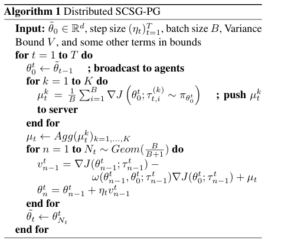

# Roadmap

- [x] Problem Settings
  * onpolicy policy gradient
  * distributed / collaborative
  * synchronous
  * homogeneous
  * byzantine
- [x] Formulation
  - [x] Extend SVRG/SCSG to distributed RL
  - [x] Apply concentration to detect Byzantine gradient
- [x] Algorithm
  - [ ] almost done; some details remaining to think through
- [X] Theoretical analysis
  - [X] Convergece 
  - [X] Sample complexity bound
- [ ] Experiments
  - [X] Dist SGD / Adam P.G.
  - [ ] Dist SVRG/SCSG P.G.
  - [ ] demonstration of successful detection
    - [ ] how to design byzantine agents, rather than random?

# TODO
- [X] Complete Formulation
- [X] Read SVRG-PG proof
- [ ] link with Byzantine opt proof
- [ ] Experiments
  - [ ] implement SCSG optimizer

### Algorithm 1

# Reference paper

* [Toward Resilient Multi-Agent Actor-Critic Algorithms for Distributed
Reinforcement Learning](http://publish.illinois.edu/shripadgade/files/2020/03/ACC2020.pdf)

## Byzantine Problem (the papers are listed in recommended order)
* [Generalized Byzantine-tolerant SGD](https://arxiv.org/pdf/1802.10116.pdf), arxiv 2018: easier to follow. 
* [Byzantine SGD](https://arxiv.org/abs/1803.08917), NeurIPS2018: Distributed SGD optimization under Byzantine settings, for convex optimization
* [Byzantine-Robust Distributed Learning: Towards Optimal Statistical Rates](https://arxiv.org/pdf/1803.01498.pdf), ICML2018: Distributed GD, convex optimization.
* [focus] [Byzantine Resilient Non-Convex SVRG with Distributed Batch Gradient Computations](https://arxiv.org/pdf/1912.04531.pdf), NeurIPS2019 workshop: Byzantine SGD for non-convex optimization.
* [likely the extension of the non-convex byzantine SGD](https://openreview.net/forum?id=PbEHqvFtcS)

## RL settings
* [Policy gradient in Lipschitz Markov Decision Processes](https://link.springer.com/article/10.1007/s10994-015-5484-1), Springer2015: proof for that the objective (expected return) and its gradient are Lipschitz continuous w.r.t policy parameters, given the assumption of Lipschitz continuity of the transition, reward function and the policies.
* [focus] [SVRG for Policy Evaluation with Fewer Gradient Evaluations](https://www.ijcai.org/Proceedings/2020/0374.pdf), IJCAI2020
* [Communication-Efficient Distributed Reinforcement Learning](https://arxiv.org/pdf/1812.03239.pdf), arxiv2019: a gradient based distributed RL.

### RL using SVRG
* [a slide on SCSG](https://lihualei71.github.io/hsieh_slides.pdf)
* [Stochastic Variance Reduction for Policy Gradient Estimation](https://arxiv.org/abs/1710.06034), arxiv 2017: replace SGD with SVRG to improve TRPO. (**is this the first one to use SVRG in RL optimization?**)
* [Stochastic Variance Reduction Methods for Policy Evaluation](https://arxiv.org/pdf/1702.07944.pdf), ICML2017: use SVRG for policy evaluation.
* [focus] [Stochastic Variance-Reduced Policy Gradient](https://arxiv.org/pdf/1806.05618.pdf), ICML2018: SVRPG. *there is a statement in intro, saying: SVRG has been used in RL as an efficient technique for optimizing the per-iteration problem in Trust-Region Policy Optimization (Xu et al., 2017) or for policy evaluation (Du et al., 2017)*
* [Policy optimization via importance sampling](https://arxiv.org/abs/1809.06098), NeurIPS2018: 8) present a surrogate objective function with a Renyi divergence (R ´ enyi et al., 1961) to reduce the variance caused ´by importance sampli
* [An Improved Convergence Analysis of Stochastic Variance-Reduced Policy Gradient](http://proceedings.mlr.press/v115/xu20a/xu20a.pdf), UAI2020: A better proof of SVRPG
* [SAMPLE EFFICIENT POLICY GRADIENT METHODS WITH RECURSIVE VARIANCE REDUCTION](https://arxiv.org/pdf/1909.08610.pdf), ICLR2020: SRVR-PG algorithm for non-convex objective $J(\theta)$

### miscellaneous 
* https://openreview.net/forum?id=rygRP2VYwB

## Analysis of RL
* [Unifying PAC and Regret: Uniform PAC Bounds for Episodic Reinforcement Learning](https://arxiv.org/abs/1703.07710) NIPS2017
* [An Off-policy Policy Gradient Theorem Using Emphatic Weightings](https://arxiv.org/pdf/1811.09013.pdf), NeurIPS2018.
* [Private Reinforcement Learning with PAC and Regret Guarantees](https://proceedings.icml.cc/static/paper_files/icml/2020/2453-Paper.pdf), ICML2020
* [Provably Efficient Reinforcement Learning with Linear Function Approximation](https://arxiv.org/abs/1907.05388), COLT2020
* [Optimality and Approximation with Policy Gradient Methods in Markov Decision Processes](http://proceedings.mlr.press/v125/agarwal20a.html), COLT2020
## survey paper
* [Variance-Reduced Methods for Machine Learning](https://arxiv.org/abs/2010.00892)
* [Where Did My Optimum Go?: An Empirical Analysis of Gradient Descent Optimization in Policy Gradient Methods](https://arxiv.org/abs/1810.02525)

## code
* https://github.com/tianbingsz/SVRG
* https://github.com/xgfelicia/SRVRPG
* https://github.com/zilunpeng/svrg_for_policy_evaluation_with_fewer_gradients

# overleaf
https://www.overleaf.com/2114528187jhfmwbtwkxmf
